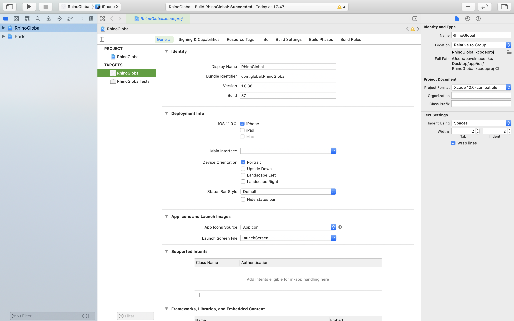
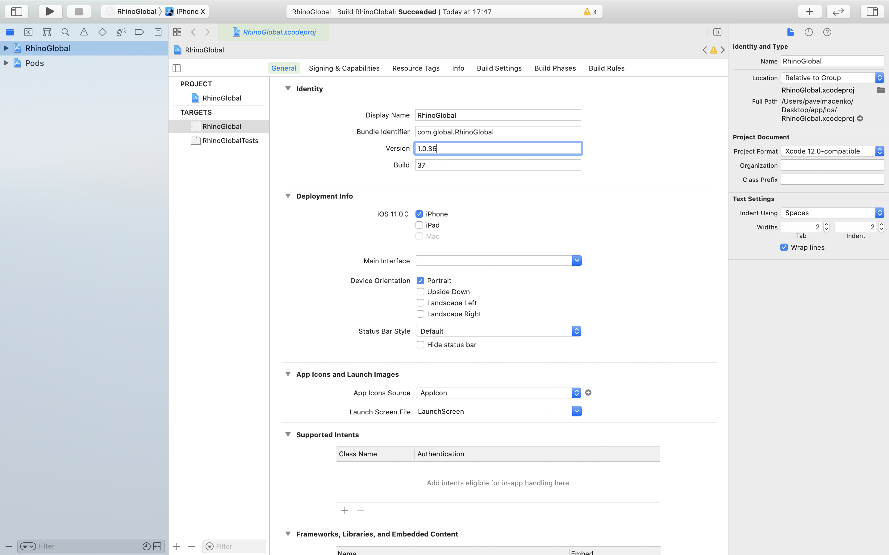
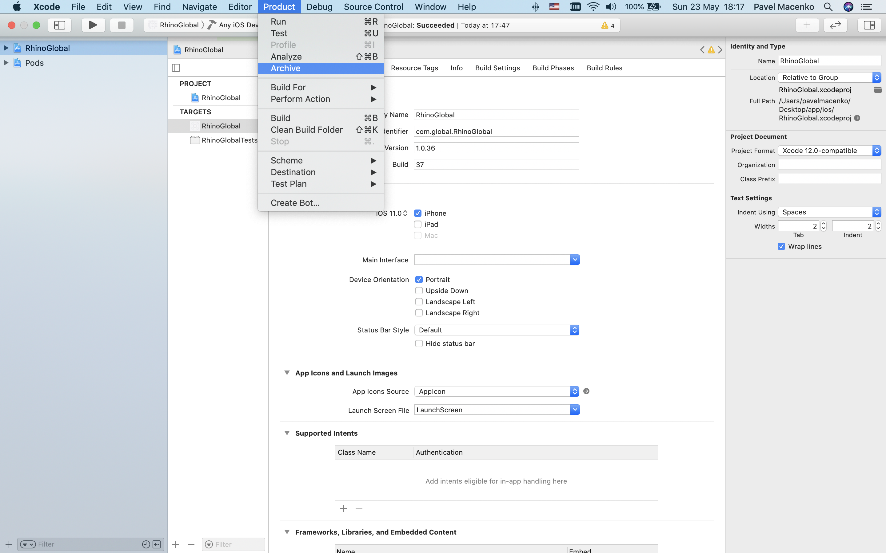
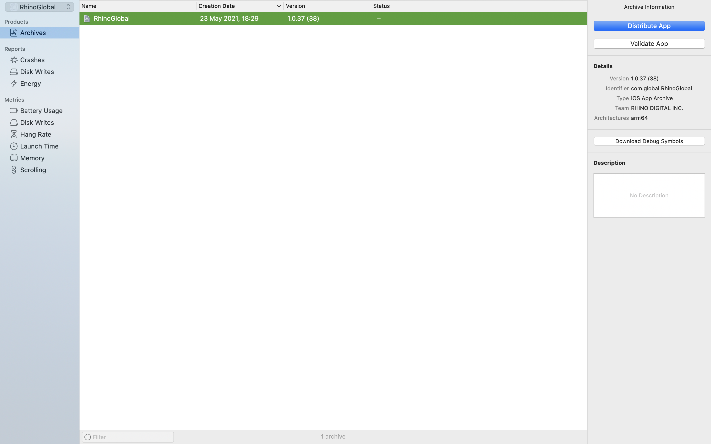
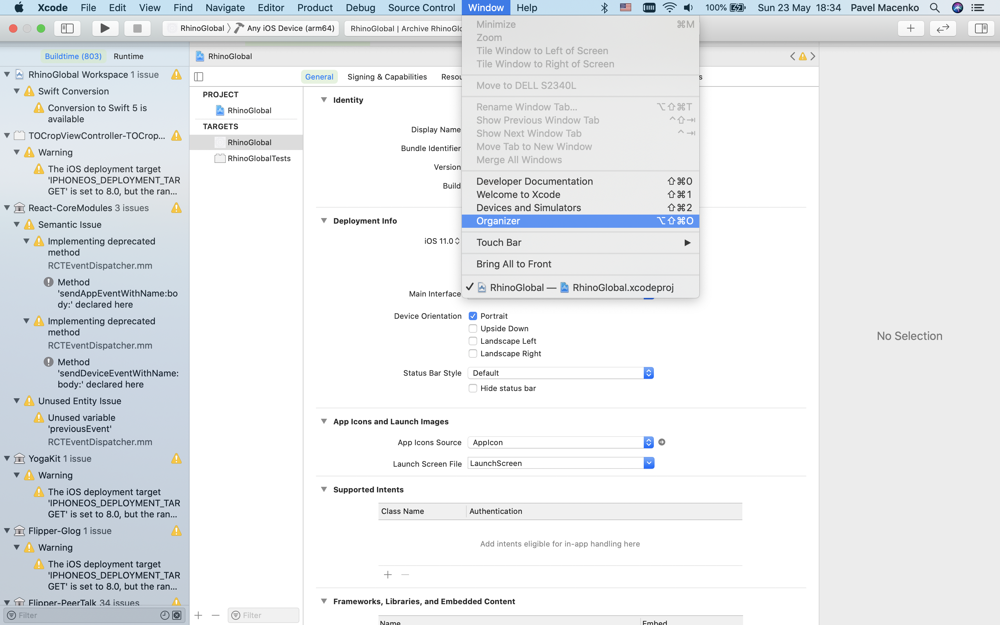

# Rhino Global app
**Mobile application for Rhino Global**

## How to build application locally
First of all download packages  — _yarn install_.
Then _cd ios && pod install_

### IOS 🍏
***⚠️Attention: you can develop only from masOS!***
##### Emulator  
1. Download [Xcode](https://apps.apple.com/ua/app/xcode/id497799835?l=ru&mt=12) if you don't have one
2. _cd ../ yarn start_
3. _in other terminal window: yarn ios_

If you get some errors — try to run the app in Xcode firstly.  

##### Real device
[React Native full documentation](https://reactnative.dev/docs/running-on-device).\
You need iOS 13 or newer
  
1. Plug in your _device_ via USB  
2. Navigate to the ios folder in your project, then open the .xcworkspace, within it using **_Xcode_**
3. Open the Product menu from Xcode's menubar, then go to Destination. Look for and select your _device_ from the list.\
   **_Xcode_** will then register your _device_ for development
4. Register for an [Apple developer account](https://developer.apple.com) if you don't have one yet
5. Select your project in the Xcode Project Navigator, then select your main target (it should share the same name as your project).\
   Look for the "General" tab. Go to "Signing and Capabilities" and make sure your Apple developer account or team is selected under the Team dropdown.
   
6. If everything is set up correctly, your _device_ will be listed as the build target in the Xcode toolbar, and it will also appear\
    in the _Devices_ pane (⇧⌘2). You can now press the Build and run button (⌘R) or select Run from the Product menu.\
    Your app will launch on your _device_ shortly.
7. You might have some errors, try this steps:
     * On your _device_  go to "Settings" → "General" → "Device Management" → "Apple Development:..." → Trust this application
     * Reload application
     * Update your **_Xcode_** version
8. _Optinal_ **Connecting to the development server**
    You can also iterate quickly on a device using the development server. You only have to be on the same Wi-Fi network as your computer.\
    Shake your _device_ to open the Developer menu, then enable Live Reload. Your app will reload whenever your JavaScript code has changed.\
    
    
    
##### Possible errors
If you got this error _error Failed to build iOS project. We ran "xcodebuild" command but it exited with error code 65._ 
you need to clear cache:

1. rm -rf node_modules && yarn cache clean
2. yarn install
3. rm -rf ~/.rncache  

Or just uninstall nvm from your machine. 
    
### Android 🤖

##### Emulator  
1. Download [Android Studio](https://developer.android.com/studio) if you don't have one
2. [Create device emulator](https://developer.android.com/studio/run/emulator) if you didn't
3. yarn android

_OR_

##### Real device
[React Native full documentation](https://reactnative.dev/docs/running-on-device).\
You need Android 7 or newer

1. To enable USB debugging on your device, you will first need to enable the "Developer options" menu by going to Settings → About phone → Software information and then tapping the Build number row at the bottom seven times. You can then go back to Settings → Developer options to enable "USB debugging".
2. Plug in your device via USB
3. Now check your device is properly connecting to ADB, the Android Debug Bridge, by running adb devices.   
4. yarn android

## How to deploy application

### IOS 🍏

#### TestFlight
1. In package.json update version manually (current version + 1)
2. In Xcode update version and build manually (current version + 1)  Version in package.json must me the same as in Xcode.
3. In header menu pick "Any iOS Device (arm 64)" ")
4. In main menu pick "Product" → "Archive".  It can take ~15 min.
5. Menu like this will be opened   
  If didn't go there manually "Window" → "Organizer" 
6. Press Distribute app in right menu. Pop-up will be opened. Step by step select: "App Store Connect" → "Upload" → "Automatically manage signing". All of this are default parameters usually.  
In the end of this process you will have screen like this   
Press Upload! Now It`s uploading to the App Store Connect. 
7. Open [App Store Connect](https://appstoreconnect.apple.com/apps) and choose current project.
8. In TestFlight tab you can see approve status. It might ask you some additional info here.
9. There are several additionally code changes in git. Make sure your version is match. Add tag 'v$version'. Push your changes with the tag.
 

